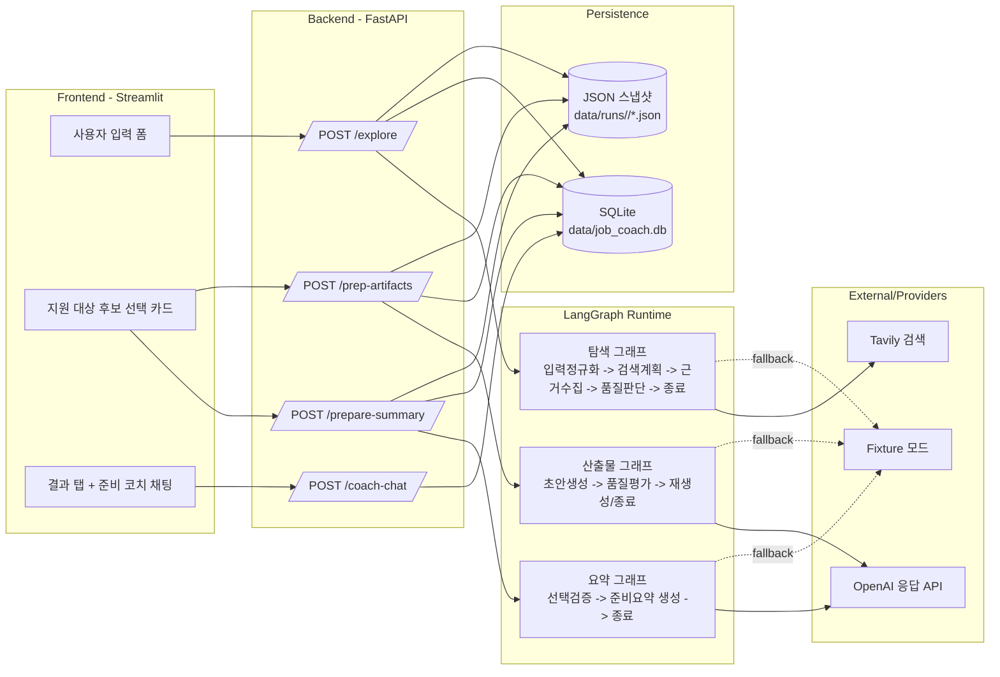

# 취업 코치형 에이전트

희망 산업, 직군, 직무를 입력하면 관련 채용 공고를 탐색하고, 선택한 지원 대상을 기준으로 분석 리포트, 자소서 초안, 면접 대비 자료, 실행 로드맵까지 한 흐름으로 정리해 주는 로컬 데모 프로젝트입니다.

프론트엔드는 Streamlit, 백엔드는 FastAPI로 구성되어 있으며 결과는 SQLite와 JSON 스냅샷으로 함께 저장됩니다.

## 주요 기능

- 산업, 직군, 직무, 경력 수준, 선호 조건, 배경 설명 입력
- 채용 사이트 직접 공고 우선 탐색
- 적절한 공고가 부족할 때 회사 정보 후보로 fallback
- 상위 후보 자동 선택 후 결과 생성
- 지원 대상 변경 패널에서 다른 후보를 다시 선택해 재생성
- 결과 탭 제공
  - 분석 리포트
  - 자소서 초안
  - 면접 대비
  - 합격 로드맵
  - 준비 코치 Q&A
- 전체 결과를 Markdown 리포트로 다운로드
- 실행 이력, 단계별 응답, 대화 내용을 SQLite와 JSON으로 저장

## 기술 구성

- Python 3.12
- FastAPI
- Streamlit
- OpenAI Responses API
- Tavily Search API
- SQLite

## PPT용 아키텍처 요약



### 영역별 기술 스택

| 영역 | 기술 스택 | 역할 | 대표 파일 |
| --- | --- | --- | --- |
| 프론트엔드 UI | `Streamlit`, `httpx`, 커스텀 HTML/JS 컴포넌트 | 입력 폼, 후보 선택 카드, 결과 탭, Markdown 다운로드, 준비 코치 UI를 제공 | `frontend/app.py`, `frontend/components/candidate_card_selector/index.html` |
| API 레이어 | `FastAPI`, `Pydantic` | 프론트와 런타임 사이의 공개 API를 제공하고 요청/응답 스키마를 검증 | `backend/app/main.py`, `backend/app/api/routes.py`, `backend/app/schemas/api.py` |
| 에이전트 런타임 | `LangGraph`, `TypedDict` 상태 관리 | 탐색, 준비 요약, 산출물 생성을 단계별 그래프로 실행 | `backend/app/runtime/graphs.py`, `backend/app/runtime/state.py` |
| 탐색 레이어 | `Tavily`, `httpx`, `BeautifulSoup4` | 채용 공고 검색, 본문 수집, 공고 URL 필터링, 신뢰도 점수 계산 | `backend/app/clients/search_client.py`, `backend/app/clients/page_fetcher.py`, `backend/app/services/exploration.py`, `backend/app/core/taxonomy.py` |
| 생성 레이어 | `OpenAI Responses API` | 준비 요약서, 실행 항목, 면접 질문, 답변 구조, 자소서 초안, 코치 답변 생성 | `backend/app/clients/llm_client.py`, `backend/app/services/preparation.py`, `backend/app/services/coach_chat.py` |
| 저장 레이어 | `SQLite`, `JSON snapshot` | 실행 이력, 단계별 응답, 채팅 기록을 저장하고 재로딩 | `backend/app/storage/session_store.py`, `data/runs/<run_id>/` |
| 실행/검증 | `uv`, `uvicorn`, `pytest`, `PowerShell` | 로컬 실행, 스모크 테스트, API 흐름 검증 | `pyproject.toml`, `scripts/run_backend.ps1`, `scripts/run_frontend.ps1`, `scripts/smoke_real.ps1`, `tests/` |

### 한 줄 요약

- 이 프로젝트는 `Streamlit` 화면에서 입력을 받고, `FastAPI`가 이를 받아 `LangGraph` 기반 취업 코치 에이전트를 실행한 뒤, 결과를 `SQLite + JSON`으로 저장하는 구조입니다.
- 외부 연동은 탐색용 `Tavily`, 생성용 `OpenAI Responses API`로 분리되어 있고, 둘 다 없을 때는 `fixture` 모드로 로컬 데모가 가능하도록 설계되어 있습니다.
- 프론트는 단일 `Streamlit` 앱이지만, 후보 선택 UX는 별도 HTML/JavaScript 컴포넌트로 분리해 카드형 선택 경험을 제공합니다.

## 요구 사항

- Python 3.12
- `uv`
- PowerShell 환경

외부 API를 사용하는 기본 모드에서는 아래 키가 필요합니다.

- OpenAI API 키
- Tavily API 키

외부 API 없이 동작 확인만 하려면 fixture 모드로 실행할 수 있습니다.

## 설치

의존성을 설치합니다.

```powershell
uv sync
```

프로젝트 루트에 `.env` 파일을 만들고 값을 채웁니다.

```env
OPENAI_API_KEY=your-openai-api-key
TAVILY_API_KEY=your-tavily-api-key
OPENAI_MODEL=gpt-5.4-mini
SEARCH_PROVIDER=tavily
LLM_PROVIDER=openai
BACKEND_BASE_URL=http://127.0.0.1:8000
```

환경 변수 의미는 아래와 같습니다.

| 변수 | 설명 |
| --- | --- |
| `OPENAI_API_KEY` | 요약, 자소서 초안, 면접 자료, 코치 답변 생성에 사용하는 OpenAI 키 |
| `TAVILY_API_KEY` | 지원 대상 후보 탐색에 사용하는 Tavily 검색 키 |
| `OPENAI_MODEL` | OpenAI 호출에 사용할 모델명 |
| `SEARCH_PROVIDER` | `tavily` 또는 `fixture` |
| `LLM_PROVIDER` | `openai` 또는 `fixture` |
| `BACKEND_BASE_URL` | Streamlit 프론트가 호출할 백엔드 주소 |

## 빠른 시작

### 1. 기본 모드: OpenAI + Tavily 사용

먼저 백엔드를 실행합니다.

```powershell
powershell -ExecutionPolicy Bypass -File .\scripts\run_backend.ps1
```

다른 터미널에서 프론트를 실행합니다.

```powershell
powershell -ExecutionPolicy Bypass -File .\scripts\run_frontend.ps1
```

브라우저에서 아래 주소로 접속합니다.

```text
http://localhost:8501
```

백엔드 상태 확인 주소는 아래와 같습니다.

```text
http://127.0.0.1:8000/health
```

### 2. Fixture 모드: 외부 API 없이 로컬 데모 실행

fixture 모드는 저장된 샘플 검색 결과와 fallback 생성 로직을 사용하므로 외부 API 키 없이도 흐름을 확인할 수 있습니다.

백엔드를 실행하는 PowerShell 세션에서 환경 변수를 override 한 뒤 서버를 실행합니다.

```powershell
$env:SEARCH_PROVIDER="fixture"
$env:LLM_PROVIDER="fixture"
powershell -ExecutionPolicy Bypass -File .\scripts\run_backend.ps1
```

프론트는 동일하게 별도 터미널에서 실행합니다.

```powershell
powershell -ExecutionPolicy Bypass -File .\scripts\run_frontend.ps1
```

참고 사항:

- fixture 모드 설정은 환경 변수를 지정한 PowerShell 세션 기준으로 적용됩니다.
- `BACKEND_BASE_URL`을 바꾸지 않는 한 프론트는 추가 설정 없이 그대로 사용할 수 있습니다.

## 사용 흐름

1. 산업, 직군, 직무와 필요하면 경력/선호 조건을 입력합니다.
2. `지원 대상 후보 탐색 및 전략 생성` 버튼을 눌러 후보를 탐색합니다.
3. 자동 선택된 후보를 기준으로 분석 리포트와 산출물이 생성됩니다.
4. 필요하면 `지원 대상 변경` 패널에서 다른 후보를 선택해 다시 생성합니다.
5. 결과 탭에서 분석 리포트, 자소서 초안, 면접 대비, 합격 로드맵, 준비 코치 Q&A를 확인합니다.
6. `전체 리포트 다운로드`로 Markdown 리포트를 저장합니다.

## 검증 방법

### 스모크 테스트

백엔드가 실행 중인 상태에서 핵심 API 흐름을 한 번에 검증할 수 있습니다.

```powershell
powershell -ExecutionPolicy Bypass -File .\scripts\smoke_real.ps1
```

직무를 바꿔서 확인하려면 인자를 넘깁니다.

```powershell
powershell -ExecutionPolicy Bypass -File .\scripts\smoke_real.ps1 -Industry "마케팅·그로스" -JobFamily "마케팅·그로스" -JobRole "콘텐츠 마케터"
```

현재 실행 중인 백엔드가 fixture 모드라면 같은 스모크 테스트도 fixture 응답 기준으로 동작합니다.

### 테스트 실행

```powershell
.\.venv\Scripts\python.exe -m pytest
```

테스트는 FastAPI TestClient와 fixture 설정을 이용해 주요 API 흐름과 정규화 로직을 검증합니다.

## 저장 데이터와 구조

- `data/job_coach.db`
  - 실행 메타데이터
  - 단계별 스냅샷
  - 준비 코치 대화 기록
- `data/runs/<run_id>/explore.json`
  - 탐색 결과 스냅샷
- `data/runs/<run_id>/prepare_summary.json`
  - 분석 리포트 스냅샷
- `data/runs/<run_id>/prep_artifacts.json`
  - 자소서 초안, 면접 대비, 로드맵 스냅샷
- `data/fixtures/sample_search_results.json`
  - fixture 모드에서 사용하는 샘플 검색 결과

## 백엔드 인터페이스

기본 백엔드 주소는 `http://127.0.0.1:8000`입니다.

| 메서드 | 경로 | 설명 |
| --- | --- | --- |
| `GET` | `/health` | 서버 상태 확인 |
| `POST` | `/explore` | 지원 대상 후보 탐색, 탐색 쿼리/후보/근거 카드 생성 |
| `POST` | `/prepare-summary` | 선택한 지원 대상을 기준으로 분석 리포트 생성 |
| `POST` | `/prep-artifacts` | 실행 항목, 면접 질문, 답변 가이드, 자소서 초안 생성 |
| `GET` | `/coach-chat/history/{run_id}` | 저장된 준비 코치 대화 기록 조회 |
| `POST` | `/coach-chat` | 현재 실행 문맥을 바탕으로 후속 질문에 답변 |

## 프로젝트 구조

- `frontend/app.py`: Streamlit UI 진입점
- `backend/app/main.py`: FastAPI 앱 진입점
- `backend/app/api/routes.py`: 공개 API 라우트
- `scripts/run_backend.ps1`: 백엔드 실행 스크립트
- `scripts/run_frontend.ps1`: 프론트 실행 스크립트
- `scripts/smoke_real.ps1`: API 흐름 점검 스크립트
- `tests/`: API 및 준비 로직 테스트

## 현재 에이전트 구조

### 런타임 공통 구조

- 모든 런타임 단계는 `AgentRuntimeState` 하나를 공유하며, 여기에 입력값, 후보 목록, 선택 대상, 준비 요약, 산출물, 경고, 재시도 상태를 누적합니다.
- 핵심 런타임은 `run_explore_graph`, `run_prepare_summary_graph`, `run_prep_artifacts_graph`의 3개 그래프로 분리되어 있습니다.
- `coach-chat`은 별도 `LangGraph` 노드는 아니며, 저장된 실행 문맥과 대화 이력을 읽어 후속 답변을 생성하는 보조 에이전트 역할을 합니다.

### 단계별 에이전트 흐름

| 단계 | 진입 API | 내부 구조 | 핵심 역할 |
| --- | --- | --- | --- |
| 1. 탐색 에이전트 | `POST /explore` | `normalize_input -> plan_search -> collect_evidence -> judge_evidence -> finalize` | 입력값을 정규화하고, 검색 쿼리를 만들고, 채용 공고를 수집한 뒤, 근거가 부족하면 재탐색합니다. |
| 2. 준비 요약 에이전트 | `POST /prepare-summary` | `check_selection -> synthesize_preparation_summary -> finalize` | 선택된 공고가 있는지 확인하고, 준비 요약서와 준비 포인트, 보완 포인트를 생성합니다. |
| 3. 산출물 에이전트 | `POST /prep-artifacts` | `generate_artifacts -> critic_artifacts -> regenerate/finalize` | 실행 항목, 예상 면접 질문, 답변 구조, 자소서 초안을 만들고, 너무 일반적이면 한 번 더 재생성합니다. |
| 4. 준비 코치 에이전트 | `POST /coach-chat` | 저장된 `run_context` + 최근 대화 이력 기반 응답 | 이전 탐색/요약/산출물과 채팅 이력을 불러와 후속 질문에 코치형 답변을 제공합니다. |

### 에이전트별 책임 분리

- 탐색 에이전트는 `Tavily` 또는 `fixture` 검색 결과를 사용하고, 직무 키워드와 직접 공고 URL 규칙으로 후보를 추립니다.
- 준비 요약/산출물 에이전트는 `OpenAI Responses API`를 우선 사용하되, 실패 시에도 즉시 보여줄 수 있는 fallback 문구를 함께 갖고 있습니다.
- 준비 코치 에이전트는 기존 실행 컨텍스트를 압축해 프롬프트에 넣고, 답변·준비 팁·후속 질문을 함께 반환합니다.
- 저장 레이어는 각 단계 결과를 `SQLite`와 `data/runs/<run_id>/*.json`에 함께 남겨, 후속 대화와 결과 재사용이 가능하도록 합니다.


### 발표용 메시지 예시

- 프론트는 `Streamlit`, 백엔드는 `FastAPI`, 에이전트 오케스트레이션은 `LangGraph`로 나눈 전형적인 Python 단일 저장소 구조입니다.
- 서비스 관점에서는 `탐색 에이전트 -> 준비 요약 에이전트 -> 산출물 에이전트 -> 준비 코치 에이전트`의 4단계 흐름으로 이해하면 됩니다.
- 운영 관점에서는 `fixture` fallback, `critic` 재생성, `SQLite + JSON` 이중 저장으로 데모 안정성과 추적 가능성을 확보한 구조입니다.

## 트러블슈팅

### 프론트에서 버튼을 눌렀는데 결과가 나오지 않을 때

- 백엔드가 먼저 실행 중인지 확인합니다.
- `http://127.0.0.1:8000/health`가 `{"status":"ok"}`를 반환하는지 확인합니다.
- 프론트는 백엔드에 의존하므로 백엔드가 죽어 있으면 결과가 생성되지 않습니다.

### `SEARCH_PROVIDER=tavily`인데 탐색이 실패할 때

- `.env` 또는 현재 세션에 `TAVILY_API_KEY`가 설정되어 있어야 합니다.
- 키 없이 기본 모드를 쓰면 `/explore` 호출이 실패합니다.
- 외부 API 없이 확인하려면 fixture 모드로 실행합니다.

### `LLM_PROVIDER=openai`인데 요약/코치 응답이 실패할 때

- `.env` 또는 현재 세션에 `OPENAI_API_KEY`가 설정되어 있어야 합니다.
- 키가 없으면 요약, 자소서 초안, 면접 자료, 준비 코치 응답 생성이 실패할 수 있습니다.
- 외부 API 없이 확인하려면 fixture 모드로 실행합니다.

### `.env`를 수정했는데 반영되지 않을 때

- 백엔드는 설정을 시작 시점에 읽으므로, `.env`를 바꾼 뒤에는 백엔드를 재시작해야 합니다.
- `BACKEND_BASE_URL`을 바꿨다면 프론트도 다시 실행하는 편이 안전합니다.

### PowerShell에서 한글이 깨질 때

- PowerShell에서는 UTF-8 환경을 권장합니다.
- 이 저장소의 인코딩 메모는 [ENCODING.md](./ENCODING.md)를 참고합니다.

## 참고

- 이 프로젝트는 공개 웹 정보를 바탕으로 후보와 준비 자료를 정리하는 로컬 데모입니다.
- 실시간 최신성이나 공고 상태의 절대 정확성을 보장하지 않습니다.
- `.env` 같은 민감 정보 파일은 저장소에 커밋하지 않는 것을 권장합니다.
